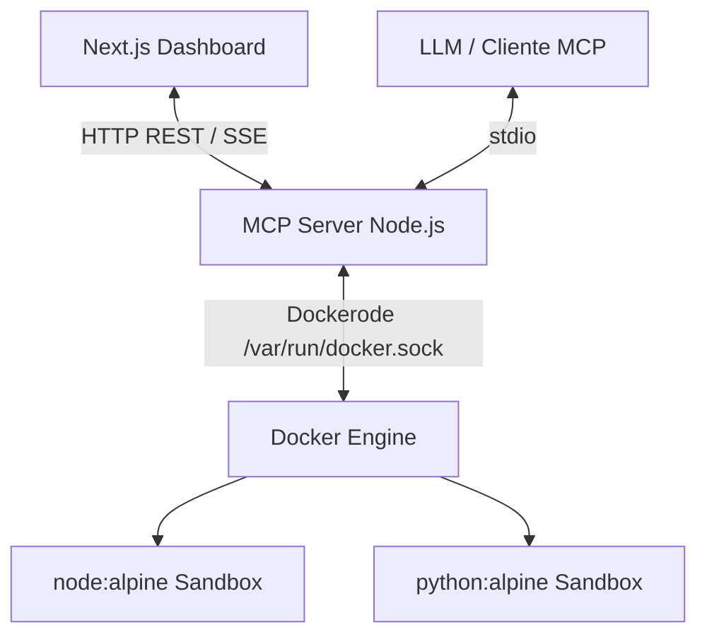

# MCP Gateway Sandbox

Plataforma Full Stack segura y aislada bajo un monorepo que expone un servidor Model Context Protocol (MCP) para ejecutar colecciones de Postman y código arbitrario en entornos Docker controlados, administrable desde una interfaz web en tiempo real.

## Arquitectura de Software y Flujo de Datos

El sistema está dividido en un monorepo (`pnpm workspace`) con dos aplicaciones desacopladas:

1. **mcp-server (Backend):** Servidor Node.js/TypeScript que implementa el protocolo MCP oficial sobre el transporte `stdio`. Además, expone APIs REST secundarias (`/api/sandbox`, `/api/postman`) en el puerto 4000 para que el Dashboard interactúe. El backend se conecta directamente al socket de Docker local para instanciar contenedores en entornos aislados (`node:alpine`, `python:alpine`) sin acceso a red y con un límite de recursos y ejecución de 5 segundos.
2. **client-dashboard (Frontend):** Aplicación Next.js 14 (App Router) estilizada con Tailwind CSS que ofrece una Terminal UI Premium para probar la inyección y ejecución de código en vivo y un Reportero visual tipo semáforo para revisar las colecciones de Postman de manera interactiva.

### Flujo de Datos



## Estructura del Proyecto

```
/
├── apps/
│   ├── backend/
│   │   ├── src/index.ts       # Servidor principal (MCP stdio + Express API)
│   │   ├── Dockerfile         # Configuración multi-stage de despliegue
│   │   ├── package.json
│   │   └── tsconfig.json
│   └── frontend/
│       ├── src/app/page.tsx   # Dashboard UI interactivo
│       ├── src/app/globals.css
│       ├── package.json
│       ├── next.config.js
│       └── tailwind.config.ts
├── package.json               # Configuración del workspace root
└── pnpm-workspace.yaml        # Declaración de aplicaciones
```

## Prerrequisitos

- Node.js >= 20.x
- **pnpm** >= 9.x
- Docker Engine corriendo (requiere `/var/run/docker.sock`)
- Tener habilitado el acceso al socket de Docker.

## Instalación y Configuración

1. Instalar todas las dependencias en el entorno root ignorando los scripts (si hay conflictos con binarios locales):
   ```bash
   pnpm install --ignore-scripts
   ```

2. Ejecutar simultáneamente el entorno de desarrollo usando la raíz del workspace:
   ```bash
   pnpm dev
   ```
   > Esto levantará de forma concurrente:
   > - El Frontend en http://localhost:3000
   > - El Backend REST en el puerto 4000
   > - El backend también se mantendrá en espera sobre stdio para clientes de MCP oficiales.

## Comandos de Construcción

Para generar el bundle de producción de todos los paquetes dentro del monorepo:

```bash
pnpm build
```

Para iniciar los entornos desde los binarios precompilados:

```bash
pnpm start
```

## Tools del MCP Disponibles

1. `execute_sandbox_code`: Inyecta payload JavaScript, TypeScript o Python en un contendor aislado (sin red, CPU/Memoria limitados a 50MB, destrucción en 5s).
2. `run_postman_collection`: Descarga y ejecuta aserciones de colecciones JSON usando `newman` en fondo, obteniendo estadísticas precisas.
